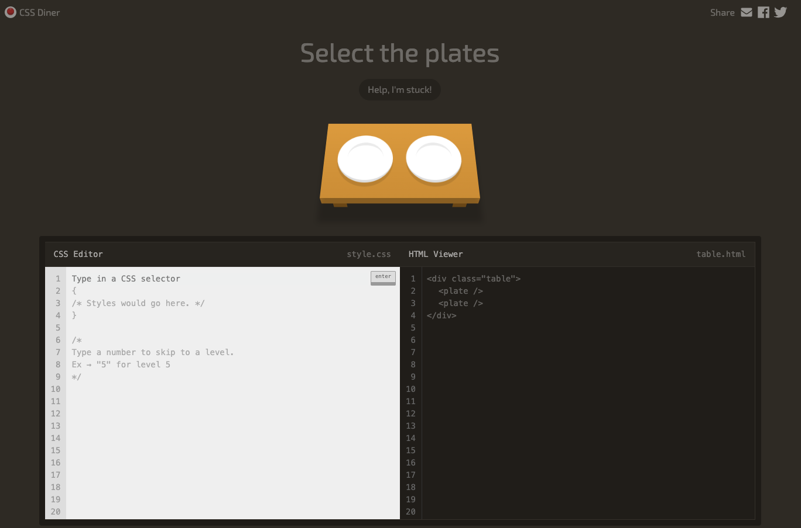

# Be better to use CSS Selectors
## Description
This is a little exercise where you can test if you are good to use different CSS selectors to style your website. There are totally 32 levels where you begin from level 1 and you have to enter the correct CSS selector for each question in the CSS-editor and then click on the small **enter** button to evaluate your input. 

# Exercise

To begin this exercise please open this website - 
[CSS-Selector Exercise](https://flukeout.github.io/). Follow the instructions on the website and try to solve as many as you can.

.